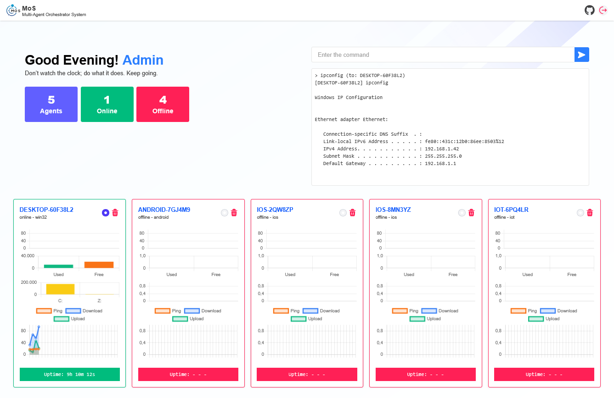

# Multi-Agent Orchestrator System (MOS)

**Multi-Agent Orchestrator System (MOS)** is a real-time, multi-agent monitoring and management system that supports multiple platforms. MOS enables device monitoring (Desktop, Mobile, IoT) from a central server via a web dashboard.
Sistem ini terdiri dari:  

- **Agent** → An application running on a target device (Windows, Linux, macOS, Android, iOS, IoT).
- **Server** → Manages agent connections, stores history, and provides a dashboard for monitoring and management.

## Key Features

### Agent

- Sends system monitoring data
   - CPU load
   - Memory (total & used)
   - Disk usage
   - Uptime
   - Network performance (ping, estimated bandwidth)
- Sends open application activity (Desktop/GUI only)
- Receives commands from the server and sends the output of the execution results
- Automatic reconnection if the WebSocket connection is lost
- Supports multiple platforms: Desktop, Mobile, IoT

### Server

- Stores agent data and monitoring history
- Real-time web dashboard displays:
- Agent status (online/offline)
- Agent system statistics
- Application activity
- Executed command output
- Sends commands to specific or all agents
- Validates commands for security
- Stores agent history in `database/<DeviceID>/`

## Project Structure

```

MOS/
│
├─ agent/
│  ├─ services/
│  │    ├─ activity.js
│  │    ├─ commands.js
│  │    ├─ connection.js
│  │    └─ monitor.js
│  ├─ app.js
│  └─ package.json
│
├─ server/
│  ├─ controllers/
│  │    ├─ auth.js
│  │    └─ dashboard.js
│  ├─ database/
│  │    ├─ <DeviceID>/
│  │    ├─ blacklist_cmd.json
│  │    ├─ agents.json
│  │    └─ users.json
│  ├─ public/
│  ├─ routes/
│  │    └─ web.js
│  ├─ services/
│  │    ├─ activity.js
│  │    ├─ commands.js
│  │    ├─ monitor.js
│  │    ├─ scheduler.js
│  │    └─ websocket.js
│  ├─ views/
│  │    ├─ components/
│  │    ├─ dashboard.ejs
│  │    └─ login.ejs
│  ├─ app.js
│  └─ package.json
│
└─ README.md
````

## How System Works

#### 1. Server provides

  * WebSocket endpoint for agent: `/ws/agent`
  * WebSocket endpoint for dashboard: `/ws/dashboard`
  * Web dashboard for agent monitoring and management

#### 2. The agent will automatically

  * Connect to the server via WebSocket
  * Send statistics and activity data
  * Receive commands from the server

#### 3. Web dashboard displays:

  * Agent status (online/offline)
  * Real-time statistics (CPU, memory, disk, network)
  * Application activity (Desktop)
  * Executed command output
  * Monitoring history

## How Endpoints Receive Data

### WebSocket Agent Endpoint (`ws://<IP_SERVER>/ws/agent`)

#### Agent Registration

When an agent first connects, it sends a message of type `register`:

   ```json
   {
     "type": "register",
     "agentId": "DEVICE_HOSTNAME",
     "platform": "windows/linux/android/ios/iot"
   }
   ```

   The server saves the agent to `agents.json` and marks it as `online`.

#### System Statistics Delivery

   The agent sends messages of type `monitor` every interval (default 5 seconds):

   ```json
   {
     "type": "monitor",
     "agentId": "DEVICE_HOSTNAME",
     "stats": {
       "hostname": "DEVICE_HOSTNAME",
       "platform": "windows",
       "cpuLoad": 12.5,
       "totalMem": 8589934592,
       "usedMem": 4294967296,
       "uptime": "2h 30m 15s",
       "disks": [
         {"drive":"C:","free":10000000000,"size":50000000000,"used":40000000000}
       ],
       "netPerformance": {"ping":12,"download":54.3,"upload":12.1}
     }
   }
   ```

#### Application Activity Delivery

   Agent sends message of type `activity` (Desktop/GUI):

   ```json
   {
     "type": "activity",
     "agentId": "DEVICE_HOSTNAME",
     "timestamp": "2025-09-10T08:00:00Z",
     "openApplications": [
       {"process":"chrome.exe","title":"Multi-Agent Dashboard"}
     ]
   }
   ```

#### Commands From Dashboard

   The dashboard sends commands via the server to the agent:

   ```json
   {
     "type": "command",
     "command": "ls -la"
   }
   ```

   The agent executes the command and sends the result:

   ```json
   {
     "type": "output",
     "agentId": "DEVICE_HOSTNAME",
     "command": "ls -la",
     "output": "total 12\n-rw-r--r-- 1 user file1\n..."
   }
   ```

#### Get Activity Request

   The server can request the agent to send activity data with the message type:

   ```json
   { "type": "get_activity" }
   ```

#### Reconnect Otomatis

   If the WebSocket connection is lost, the agent tries to reconnect every 3 seconds until successful.

---

## System Flow

```
+--------+      WebSocket     +--------+     WebSocket      +-----------+
| Agent  | -----------------> | Server | <----------------- | Dashboard |
|        | <----------------- |        | -----------------> |           |
+--------+                    +--------+                    +-----------+
```

* **Agent → Server**: `register`, `monitor`, `activity`, `output`
* **Server → Dashboard**: Monitoring data, history, output
* **Dashboard → Server → Agent**: Execute command (`command`)

## Installation

### 1. Server

```bash
cd server
npm install
node app.js
```

### 2. Agent

```bash
cd agent
npm install
node app.js
```

> Make sure the `SERVER_URL` in `agent/app.js` matches the server address

## Configuration

* **Server URL** agent:

```javascript
// agent/app.js
const SERVER_URL = 'ws://<IP_SERVER>:8000/ws/agent';

// server/public/assets/js/dashboard.js
const ws = new WebSocket("ws://<IP_SERVER>:8000/ws/dashboard");
```

* The monitoring interval can be changed in `agent/services/connection.js` and `server/services/websocket.js`
* The database path is in `server/database/`
* It is recommended to use TLS for WebSocket (`wss://`) for security.

## Demo Account

```
Username: admin
Password: admin
```

## Lisensi

MIT License
